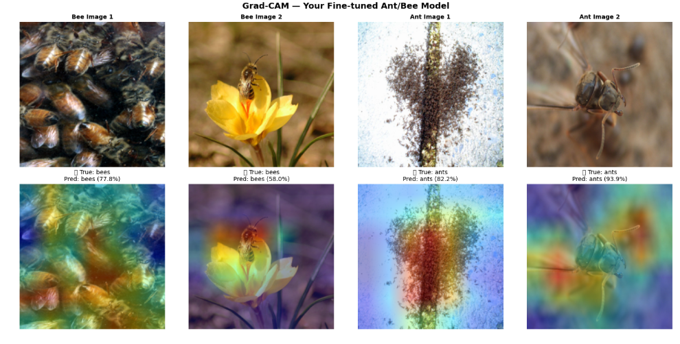
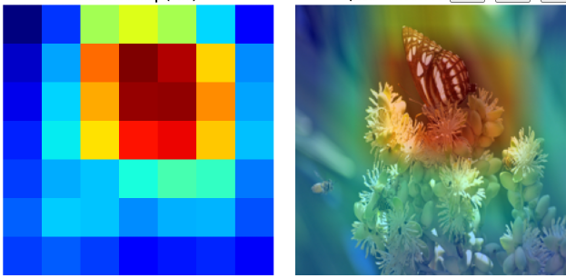
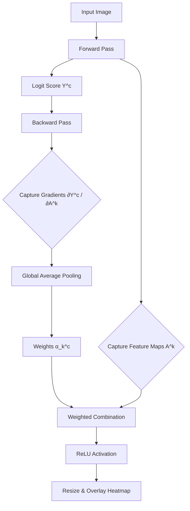
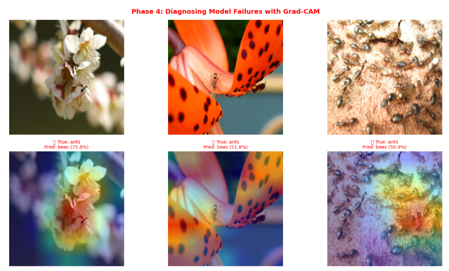

# 🧠 Beyond the Black Box: Explainable AI & ResNet Ablation Study

**An experimental deep-dive deconstructing Convolutional Neural Networks (CNNs) using custom PyTorch Hooks, Grad-CAM diagnostics, and Ablation Studies.**

---

## 📖 Project Overview

This repository contains a comprehensive **Explainable AI (XAI)** and **Transfer Learning** ablation study. Rather than treating deep neural networks as "black boxes," this project implements visualization engines from scratch using PyTorch hooks to expose the inner representations, weight distributions, and decision-making drivers of computer vision models.

Using an Ant vs. Bee classification task (N = 244), we contrast a custom CNN trained from scratch against a pre-trained ResNet18 model to evaluate performance, feature abstraction quality, and dataset biases.

---

## 🔬 1. The Ablation Study: Proving Transfer Learning

To empirically analyze the necessity of foundation models in data-starved environments, we controlled for model initialization and architecture:

| Model Architecture | Initialization | Trainable Parameters | Top Val Accuracy | Convergence Speed |
| :--- | :--- | :--- | :---: | :---: |
| **Custom 3-Layer CNN** | Random (Scratch) | ~1.2M | **60.7%** ❌ | Slow / Flat |
| **ResNet18** | Random (Scratch) | ~11.2M | **71.2%** ⚠️ | Moderate |
| **ResNet18** | Pre-trained (ImageNet) | **2,048** (FC layer only) | **94.7%** ✅ | Ultra-Fast (<5 Epochs) |

### Key Takeaway
Advanced architectures (like ResNet18 with skip connections) alone cannot overcome extreme data starvation. Pre-trained weights act as the primary driver of high performance, transferring complex visual hierarchies learned from 1.2M ImageNet images to converge in just a few epochs.

---

## 👁️ 2. Peeking Inside the ConvNet (Filter Visualization)

Convolutional layers learn spatial filters (kernels) to detect patterns. We extracted the weights of the very first convolutional layer (`conv1`) to observe what features are prioritized.

### Dead Filter Detection
Using standard deviation profiling ($\sigma < 0.01$), we detected collapsed or "dead" filters that do not activate. Pre-trained distributions display structured visual features, whereas randomly initialized networks display unstructured noise.

  
  
   
  <i>Figure 1: <b>Left</b>: Pre-trained ResNet18 Conv1 kernels showing Gabor-like edge detectors, color gradients, and textures (Red squares mark collapsed/dead filters). <b>Right</b>: Custom CNN kernels showing completely noisy, unorganized pixel distributions.</i>

---

## 🎯 3. Diagnosing Failures with Grad-CAM (Explainable AI)

To understand *why* the model makes decisions, we built a **Grad-CAM (Gradient-Weighted Class Activation Mapping)** engine from scratch. Grad-CAM uses the gradients flowing into the final convolutional layer to calculate weight maps indicating the pixels most influential in predicting a class.

### Mathematical Pipeline
$$\alpha_k^c = \frac{1}{Z} \sum_{i} \sum_{j} \frac{\partial Y^c}{\partial A_{i, j}^k}$$
$$L_{\text{Grad-CAM}}^c = \text{ReLU}\left(\sum_{k} \alpha_k^c A^k\right)$$

### 🚨 Exposing Background Bias (Error Analysis)
The pre-trained model achieved **94.7% validation accuracy**, but error analysis of the remaining 5.3% misclassifications revealed a major dataset vulnerability: **Background Bias**.

  
   
  <i>Figure 2: Grad-CAM Error Diagnosis. Top row shows input images misclassified as "bees". Bottom row shows Grad-CAM heatmaps showing the model activating heavily on yellow flower petals and white blossoms, ignoring the actual insect morphology.</i>

> [!WARNING]
> High accuracy metrics can mask critical flaws. Grad-CAM proved that the model did not learn to isolate the insect's body, but instead relied on correlative shortcuts like `yellow petals = bee`.

---

## 🛠️ Code Structure & Setup

### Prerequisites
* Python 3.9+
* PyTorch & Torchvision
* OpenCV-Python
* Matplotlib & NumPy

### Repository Contents
* `Transfer_Learning_XAI.ipynb`: The main clean notebook containing all 5 phases of the study.
* `assets/`: Directory containing output plots and visualizations.
* `.gitignore`: Configured to exclude heavy model checkpoints (`.pth`) and the raw dataset directory (`hymenoptera_data/`).

---

<i>"You do not truly understand a neural network until you can visualize its mistakes."</i>

