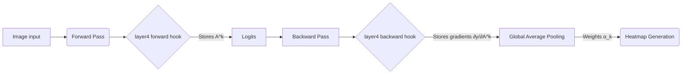

  
# 🧠 Beyond the Black Box: Explainable AI & Transfer Learning

*An experimental study deconstructing Convolutional Neural Networks (CNNs) using PyTorch Hooks, Grad-CAM, and Ablation Studies.*

 

> [!NOTE]
> **Executive Summary:** This project goes beyond simply achieving high accuracy. It answers *why* and *how* neural networks make decisions by building Explainable AI (XAI) tools from scratch. It proves the efficacy of Transfer Learning via an ablation study and uncovers hidden dataset biases using Gradient-Weighted Class Activation Mapping.

---

## 🔬 1. The Ablation Study: Proving Transfer Learning

To empirically prove why foundation models are necessary for data-starved environments (N = 244 images), an ablation study was conducted controlling for architecture:

| Model Architecture | Initialization | Trainable Params | Validation Accuracy |
| :--- | :--- | :--- | :--- |
| **Custom 3-Layer CNN** | Random (From Scratch) | 1.2M | **60.7%** ❌ |
| **ResNet18** | Random (From Scratch) | 11.2M | **71.2%** ⚠️ |
| **ResNet18** | Pre-trained (ImageNet) | Final FC Layer Only | **94.7%** ✅ |

*Conclusion:* Advanced architectures alone cannot overcome data starvation. Pre-trained weights are the primary driver of rapid convergence and high performance.

---

## 👁️ 2. Peeking Inside the ConvNet (Feature Extraction)

Neural networks learn hierarchical representations. By extracting the raw spatial weights of `conv1`, we can observe the primitive edge-detectors the model learned from 1.2 million ImageNet images.

* **Dead Filter Detection:** Used standard deviation heuristics (`std < 0.01`) to identify collapsed filters within the pre-trained distribution.
* **Filter Visualization:** Mapped multi-dimensional tensors `[out_c, in_c, H, W]` to normalized RGB visualizations to contrast structured Gabor filters against the random noise of networks trained from scratch.

---

## 🎯 3. Diagnosing Failures with Grad-CAM (Explainable AI)

A 94.7% accuracy rate is excellent, but XAI demands we understand the 5.3% failure rate. Is the model looking at the subject, or cheating?

I implemented **Grad-CAM (Gradient-Weighted Class Activation Mapping)** entirely from scratch using PyTorch forward and backward hooks.

### 🚨 Finding "Background Bias"
Grad-CAM analysis revealed a fascinating dataset vulnerability. The model occasionally suffered from **Background Bias**—tricking itself into predicting "bee" simply because an ant was photographed sitting on a yellow flower. 

> [!WARNING]
> High accuracy metrics can mask fatal dataset biases. Grad-CAM proved that the model learned a correlative shortcut (`yellow petals = bee`) rather than purely isolating the insect's morphology.

---

## 🛠️ Code Structure & Setup

### Prerequisites
* Python 3.9+
* PyTorch & Torchvision
* OpenCV & Matplotlib

### Core Implementation
The entire study is contained within the Jupyter Notebook. It is cleanly structured into 4 sequential phases:
1. **Data Pipeline:** Transforms, Normalization, and DataLoader setup.
2. **Transfer Learning Setup:** Parameter freezing (`requires_grad=False`), Head substitution, and Training Loop.
3. **Weight Analysis:** Tensor detachment and Variance mapping.
4. **Grad-CAM Engine:** Hook registration, Backpropagation capturing, and OpenCV overlay rendering.

---

<i>"You do not truly understand a neural network until you can visualize its mistakes."</i>

